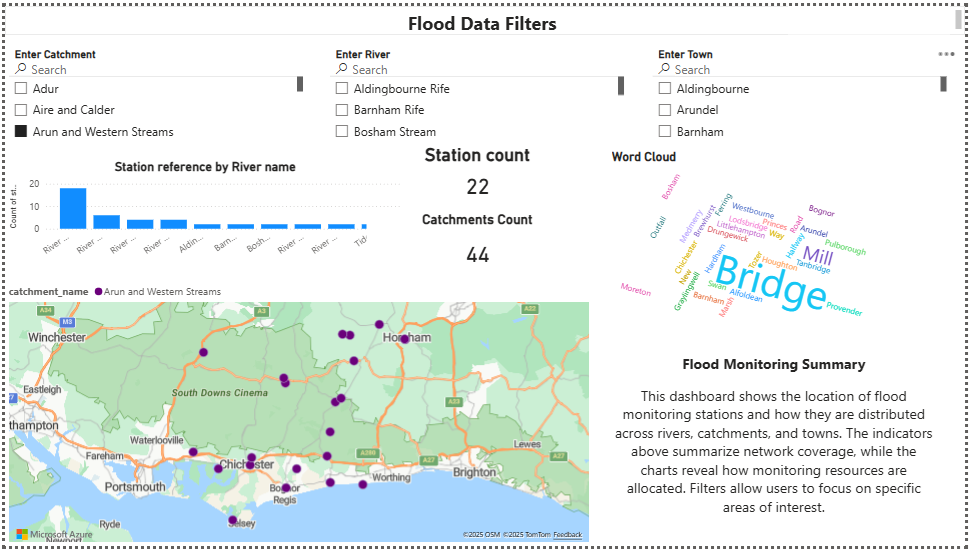

# Azure Environment Data ETL Pipeline (Flood Monitoring)

## Overview
This project implements an end-to-end **Azure-based ETL pipeline** that ingests public UK Environment Agency flood monitoring data into a centralized **Azure Data Lake (ADLS Gen2)** for analytics and reporting.



The pipeline is built using **Azure Data Factory**, follows data lake architecture, and is designed to be production-aligned.

**Structures**:
-  **Raw**
-  Datasets using **Synapse Serverless SQL**, materializes it as **Parquet**, and prepares curated (Silver) 
- Datasets for reporting in **Power BI** (Gold)


##### For Step by Step guid and screenshots, please read [Step_By_Step.md](Step_By_Step.md)
---

## Architecture
**Technology stack**
- Azure Data Factory (orchestration & ingestion)
- Azure Data Lake Storage Gen2 (Raw / Silver / Gold zones)
- Azure Synapse Analytics (Serverless SQL – planned)
- Power BI (reporting – planned)

```
Environment Agency REST API
            ↓
Azure Data Factory (Copy Activity)
            ↓
Azure Data Lake Storage Gen2 (Raw JSON)
            ↓
Synapse Serverless SQL (Silver / Gold – next phase)
            ↓
Power BI
```

---

## Data Source
- **UK Environment Agency – Flood Monitoring API**
- Base URL:
  https://environment.data.gov.uk/flood-monitoring
- Endpoint used:
  - `id/stations.json`

The API is publicly available under the UK Open Government Licence.

---

## Data Lake Structure

```
datalake/
├── raw/
│   └── flood_ea/
│       └── ingest_date=YYYY-MM-DD/
│           └── stations_YYYYMMDD_HHMMSS.json
├── silver/        
└── ref/
```

- **Raw**: Immutable JSON payloads exactly as received from the API
- **Silver**: Parsed, typed, and cleaned datasets (planned)
- **Gold**: Aggregated reporting-ready tables (planned)

---

## Azure Resources
- Resource Group: `hassan_rg-env-datalake-dev`
- Storage Account (ADLS Gen2): `hassanstenvdatalakedev`
- Data Factory: `hassan-adf-env-ingestion-dev`
- Synapse Workspace: `hassan-syn-env-analytics-dev`

---

## Identity & Security
- Azure Data Factory uses **system-assigned managed identity**
- No storage account keys or secrets are used
- RBAC:
  - `Storage Blob Data Contributor` assigned to ADF and Synapse
- ADLS Gen2 hierarchical namespace enabled

---

## Ingestion Pipeline (Raw Layer)

### Pipeline
- Name: `pl_ingest_flood_ea_raw`
- Activity: Copy Data

### Source
- REST dataset: `ds_flood_ea_rest`
- Relative URL: `id/stations.json`
- Authentication: Anonymous
- HTTP method: GET

### Sink
- ADLS Gen2 JSON dataset: `ds_adls_flood_ea_raw_json`
- Date-partitioned folders
- Dynamic file naming to avoid overwrite

```
ingest_date = yyyy-MM-dd
file_name   = stations_yyyyMMdd_HHmmss.json
```

---

## Key Features
- Automated ingestion from a public REST API
- Parameterised datasets for reuse
- Date-based partitioning in the data lake
- Raw zone preserves original API payload
- Designed for daily scheduled execution

---

## Current Status
- Raw ingestion pipeline - implemented and validated
- Silver layer (Synapse Serverless SQL) – implemented and validated
- Gold layer & Power BI reporting – planned

---

## Next Steps
1. Build Gold tables for analytics
2. Develop Power BI dashboards
