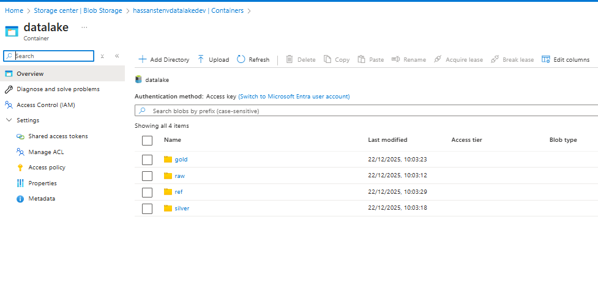
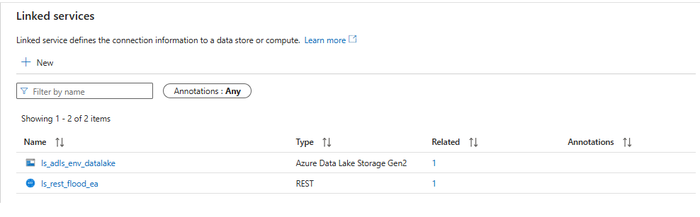
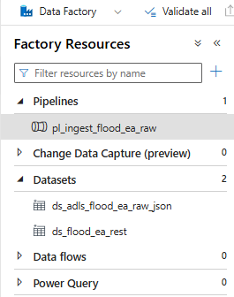
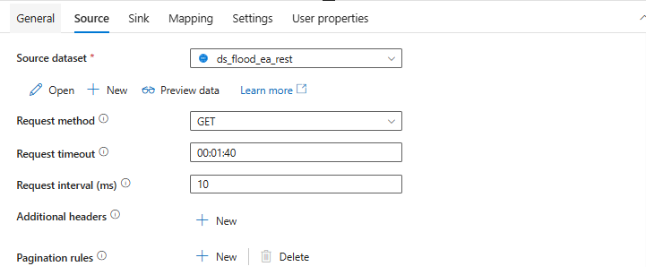
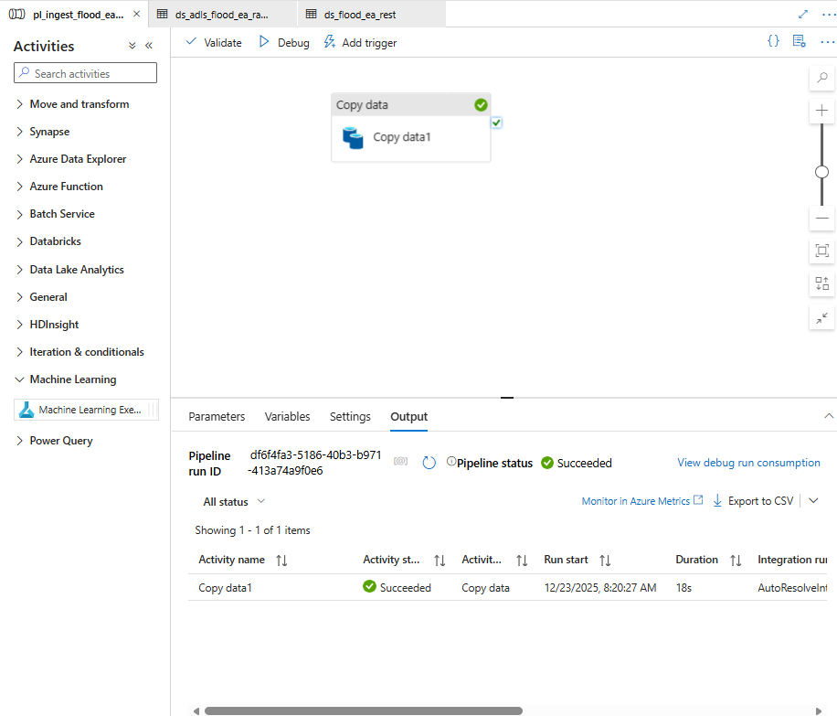
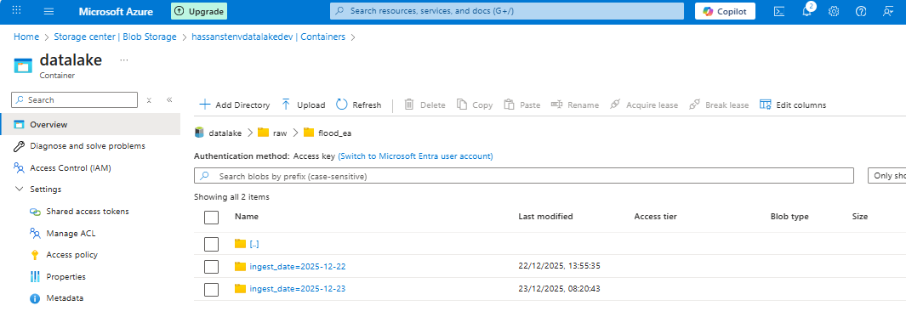
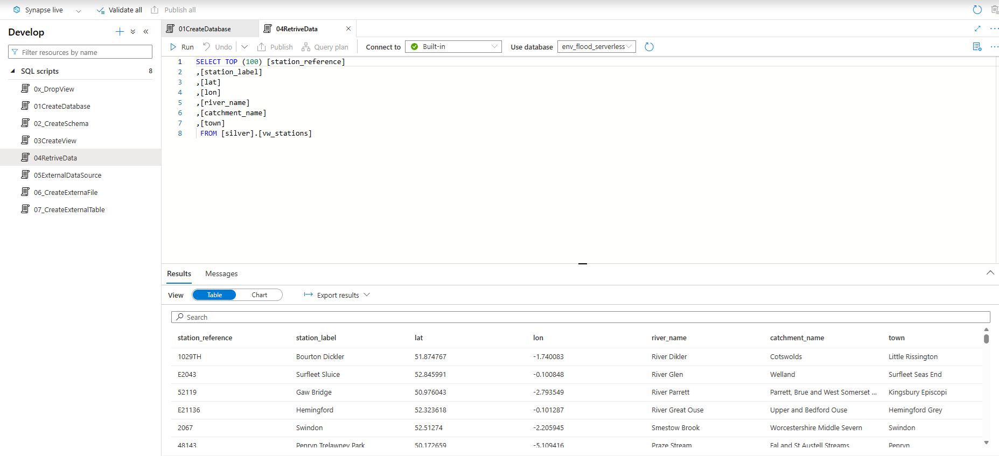

# Build Guide - Azure Flood Data ETL Pipeline

This document is a **step-by-step implementation guide** for the Azure Flood Monitoring ETL pipeline.
It is intended for:
- Personal revision
- Rebuilding the project from scratch
- Demonstrating hands-on Azure experience


---

## 0. Prerequisites
- Active Azure subscription
- Contributor access to subscription or resource group
- Azure Portal access
- Azure Data Factory Studio
- Azure Synapse Studio 

---

## 1. Create Resource Group
**Azure Portal → Resource groups → Create**
- Name: `hassan-rg-env-datalake-dev`
- Region: UK South (or same region for all resources)
- Create
---

## 2. Create ADLS Gen2 Storage Account
**Azure Portal → Storage accounts → Create**
- Name: `hassanstenvdatalakedev`
- Region: same as RG
- Performance: Standard
- Redundancy: LRS
- Advanced:
  - Enable **Hierarchical namespace**
- Review + Create

### 2.1 Create container
**Storage account → Containers → + Container**
- Name: `datalake`
- Public access: Private
- Create folders as stated in the ReadMe file.

---

## 3. Create Azure Data Factory
**Azure Portal → Data factories → Create**
- Name: `hassan-adf-env-ingestion-dev`
- Region: same as RG
- Version: V2
- Create

---

## 4. Configure Managed Identity & Permissions

### 4.1 Enable ADF managed identity
**ADF → Identity**
- System assigned: On
- Save

### 4.2 Assign RBAC on storage
**Storage account → Access control (IAM) → Add role assignment**
- Role: Storage Blob Data Contributor
- Assign access to: Managed identity
- Select: Data Factory managed identity
- Save

---

## 5. Create Linked Services

### 5.1 REST Linked Service
**ADF Studio → Manage → Linked services → + New**
- Type: REST
- Name: `ls_rest_flood_ea`
- Base URL:
  ```
  https://environment.data.gov.uk/flood-monitoring
  ```
- Authentication: Anonymous
- Test connection → Create

### 5.2 ADLS Gen2 Linked Service

**ADF Studio → Manage → Linked services → + New**
- Type: Azure Data Lake Storage Gen2
- Name: `ls_adls_env_datalake`
- Authentication: System-assigned managed identity
- Storage account: `hassanstenvdatalakedev`
- Test connection → Create

---

## 6. Create Datasets

### 6.1 REST Dataset
**ADF Studio → Author → + Dataset**
- Type: REST
- Name: `ds_flood_ea_rest`
- Linked service: `ls_rest_flood_ea`
- Relative URL:
  ```
  id/stations.json
  ```
- Save

### 6.2 ADLS JSON Dataset (Raw)
**ADF Studio → Author → + Dataset**
- Type: ADLS Gen2
- Format: JSON
- Name: `ds_adls_flood_ea_raw_json`
- Linked service: `ls_adls_env_datalake`

#### Parameters
| Name | Type |
|----|----|
| ingest_date | String |
| file_name | String |

#### Connection
- File system: `datalake`
- Directory:
  ```
  @concat('raw/flood_ea/ingest_date=', dataset().ingest_date)
  ```
- File name:
  ```
  @dataset().file_name
  ```
- Save

---

## 7. Create Pipeline

### 7.1 Create pipeline
**ADF Studio → Author → + Pipeline**
- Name: `pl_ingest_flood_ea_raw`

### 7.2 Add Copy Data activity
- Drag **Copy data** onto canvas

#### Source tab
- Source dataset: `ds_flood_ea_rest`
- Leave all other fields default

#### Sink tab
- Sink dataset: `ds_adls_flood_ea_raw_json`
- Dataset properties:
  ```
  ingest_date = @formatDateTime(utcNow(),'yyyy-MM-dd')
  file_name   = @concat('stations_', formatDateTime(utcNow(),'yyyyMMdd_HHmmss'), '.json')

  ```
  Copy behavior = Preserve hierarchy
  
---

## 8. Debug & Validate
- Click **Debug**
- Confirm success


### 8.1 Validate in Storage
**Storage account → Containers → datalake**
Verify:
```
raw/flood_ea/ingest_date=YYYY-MM-DD/stations_YYYYMMDD_HHMMSS.json
```
 
---

## 9. Create Synapse Serverless SQL database

### 9.1 Create workspace
- Azure Synapse Analytics → Create:
  - Resource group: `hassan-rg-env-datalake-dev`
  - Workspace name: `synapsews00001`
  - Security → SQL password: `Your_Strong_Password`
### 9.2 
- Azure Synapse Analytics → synapsews00001 → Develop → SQL Script: Built-in
- Create Database:
```sql
CREATE DATABASE env_flood_serverless;
GO
```
- Create Schema:
```sql
USE env_flood_serverless;
GO

CREATE SCHEMA silver;
GO
```
- Create View:
```sql

CREATE OR ALTER VIEW silver.vw_stations AS
SELECT
    JSON_VALUE(item.value, '$.stationReference') AS station_reference,
    JSON_VALUE(item.value, '$.label')           AS station_label,
    TRY_CAST(JSON_VALUE(item.value, '$.lat')  AS float) AS lat,
    TRY_CAST(JSON_VALUE(item.value, '$.long') AS float) AS lon,
    JSON_VALUE(item.value, '$.riverName')       AS river_name,
    JSON_VALUE(item.value, '$.catchmentName')   AS catchment_name,
    JSON_VALUE(item.value, '$.town')            AS town
FROM OPENROWSET(
        BULK 'raw/flood_ea/ingest_date=*/stations_*.json',
        FORMAT = 'CSV',
        FIELDTERMINATOR = '0x0b',
        FIELDQUOTE      = '0x0b',
        ROWTERMINATOR   = '0x0b'
     )
     WITH (json_doc NVARCHAR(MAX)) AS src
CROSS APPLY OPENJSON(src.json_doc, '$.items') AS item;

```
- Retrive Data:
```sql
SELECT TOP (100) [station_reference]
,[station_label]
,[lat]
,[lon]
,[river_name]
,[catchment_name]
,[town]
 FROM [silver].[vw_stations]
```

- Create Parquet:
  - Creates the external data source
```sql
CREATE EXTERNAL DATA SOURCE datalake
WITH (
    LOCATION = 'silver/'
);


SELECT name, location
FROM sys.external_data_sources;
```
  - CETAS to write Parquet files
  - This script assumes ff_parquet already exists!
```sql
CREATE EXTERNAL TABLE silver.stations_parquet
WITH (
    LOCATION = 'silver/flood_ea/stations_v2/',
    DATA_SOURCE = datalake,
    FILE_FORMAT = ff_parquet
)
AS

SELECT
    station_reference,
    station_label,
    lat,
    lon,
    river_name,
    catchment_name,
    town
FROM silver.vw_stations;
```

- Create and write Parquet files
```sql
CREATE EXTERNAL TABLE silver.stations_parquet
WITH (
    LOCATION = 'silver/flood_ea/stations/',     
    DATA_SOURCE = datalake,
    FILE_FORMAT = ff_parquet
)
AS
SELECT
    station_reference,
    station_label,
    lat,
    lon,
    river_name,
    catchment_name,
    town
FROM silver.vw_stations;
GO
```

## 10. Common Issues & Fixes

### REST 404 Error
- Ensure Base URL includes `/flood-monitoring`
- Ensure Relative URL is `id/stations.json`

### ADLS PathNotFound
- Use dynamic file names
- Ensure managed identity has Blob Data Contributor
- Ensure hierarchical namespace enabled

---


## 11. What Is Intentionally Not Done Yet
- Triggers / scheduling
- Pagination for large endpoints
- Aggregations
- Power BI dashboards

These are future phases.

---


## 12. Next Phase (Planned)
- Expose Gold views for Power BI
